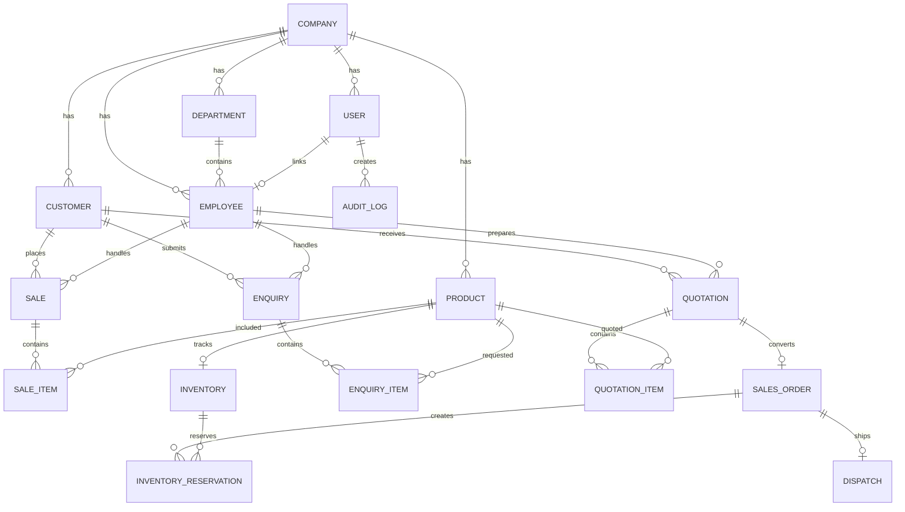

# FundsRoom ERP ER Diagram

```mermaid
erDiagram
  COMPANY ||--o{ USER : has
  COMPANY ||--o{ DEPARTMENT : has
  COMPANY ||--o{ EMPLOYEE : has
  COMPANY ||--o{ CUSTOMER : has
  COMPANY ||--o{ PRODUCT : has
  DEPARTMENT ||--o{ EMPLOYEE : contains
  USER ||--o| EMPLOYEE : links
  CUSTOMER ||--o{ SALE : places
  EMPLOYEE ||--o{ SALE : handles
  SALE ||--o{ SALE_ITEM : contains
  PRODUCT ||--o{ SALE_ITEM : included
  PRODUCT ||--o| INVENTORY : tracks
  CUSTOMER ||--o{ ENQUIRY : submits
  EMPLOYEE ||--o{ ENQUIRY : handles
  ENQUIRY ||--o{ ENQUIRY_ITEM : contains
  PRODUCT ||--o{ ENQUIRY_ITEM : requested
  CUSTOMER ||--o{ QUOTATION : receives
  EMPLOYEE ||--o{ QUOTATION : prepares
  QUOTATION ||--o{ QUOTATION_ITEM : contains
  PRODUCT ||--o{ QUOTATION_ITEM : quoted
  QUOTATION ||--o| SALES_ORDER : converts
  SALES_ORDER ||--o{ INVENTORY_RESERVATION : creates
  INVENTORY ||--o{ INVENTORY_RESERVATION : reserves
  SALES_ORDER ||--o| DISPATCH : ships
  USER ||--o{ AUDIT_LOG : creates
```
